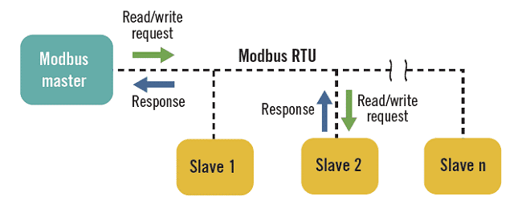
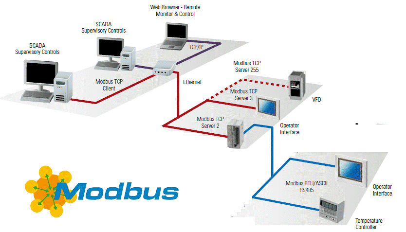
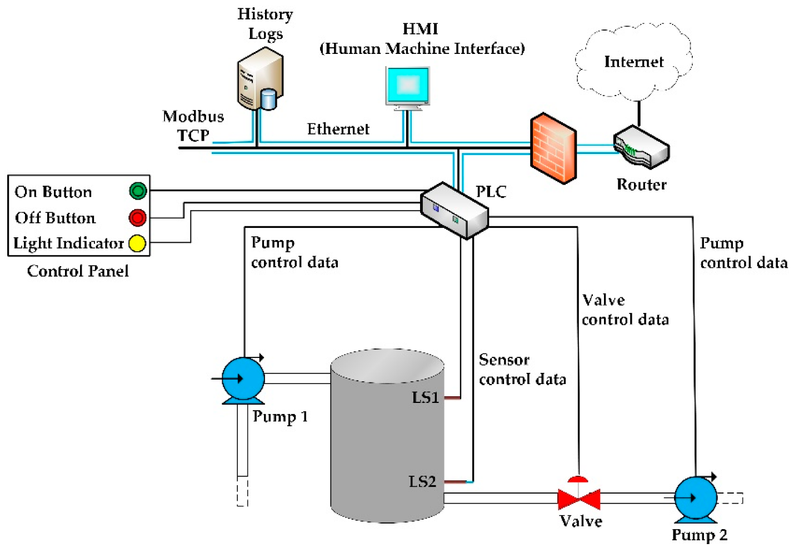
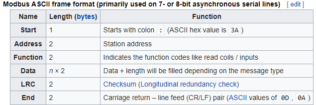

**Synchronous Socket Communication Project**

The following code example demonstrates the use of TCP/IP sockets for device to device communication.

**Purpose/Intention**

This project was intended to demonstrate capabilities in C# and object-oriented programming with a simple example synchronous socket communication example. This project also provided me an opportunity to practice with socket programming and master-slave communications. Initially I had big plans for this project but I had to scale back to more of an “MVP” (Minimal Viable Product) approach. This example mirrors aspects of [Modbus](https://product-help.schneider-electric.com/ED/ES_Power/NT-NW_Modbus_IEC_Guide/EDMS/DOCA0054EN/DOCA0054xx/Master_NS_Modbus_Protocol/Master_NS_Modbus_Protocol-2.htm) and the description below will compare and contrast it to Modbus. Wikipedia describes Modbus as follows:

“**Modbus** is a data [communications protocol](https://en.wikipedia.org/wiki/Communications_protocol "Communications protocol") originally published by Modicon (now [Schneider Electric](https://en.wikipedia.org/wiki/Schneider_Electric "Schneider Electric")) in 1979 for use with its [programmable logic controllers](https://en.wikipedia.org/wiki/Programmable_logic_controller "Programmable logic controller") (PLCs). Modbus has become a _[de facto](https://en.wikipedia.org/wiki/De_facto "De facto")_ [standard](https://en.wikipedia.org/wiki/Standardization "Standardization") communication protocol and is now a commonly available means of connecting industrial [electronic](https://en.wikipedia.org/wiki/Electronics "Electronics") devices.[[1]](https://en.wikipedia.org/wiki/Modbus#cite_note-Drury2009-1) Modbus is popular in industrial environments because it is openly published and [royalty-free](https://en.wikipedia.org/wiki/Royalty-free "Royalty-free"). It was developed for industrial applications, is relatively easy to deploy and maintain compared to other standards, and places few restrictions - other than the datagram (packet) size - on the format of the data to be transmitted. Modbus uses the [RS485](https://en.wikipedia.org/wiki/RS-485 "RS-485") or Ethernet as its wiring type. Modbus supports communication to and from multiple devices connected to the same cable or Ethernet network. For example, a device that measures temperature and a different device to measure humidity, both of which communicates the measurements to a [computer](https://en.wikipedia.org/wiki/Computer "Computer").

Modbus is often used to connect a plant/system supervisory computer with a [remote terminal unit](https://en.wikipedia.org/wiki/Remote_terminal_unit "Remote terminal unit") (RTU) in Supervisory Control and Data Acquisition ([SCADA](https://en.wikipedia.org/wiki/SCADA)) systems in the electric power industry. Many of the data types are named from industrial control of factory devices, such as [Ladder logic](https://en.wikipedia.org/wiki/Ladder_logic "Ladder logic") because of its use in driving relays: A single physical output is called a _coil_, and a single physical input is called a _discrete input_ or a _contact_.”

Modbus is a simple but powerful communications protocol that is still in widespread use today.

The following diagram depicts the flow of requests and responses from the master to the slave in Modbus:

This diagram shows an example of the network topology for how Modbus is deployed:

This diagram shows the context of how Modbus is used to communicate with PLCs, sensors, pumps, valves, etc.:

**How it works**

This example is built with a synchronous socket. As a result, the server application will be suspended until a client connects to it. When the application is first started, it will open the sensor configuration file and read in configuration for each sensor. This is only done once per execution and the configuration is stored in a list of SensorConfig objects. Next the server will create a socket and listen for connection requests. The client program connects to the server and sends requests (in this case it plays the master role). It also uses a synchronous socket which results in the client application being suspended until the server provides a response.

Once a connection is made, the server application receives a command from the client, and then responds with the requested data. Note, that I had intended to build functionality to ‘Send All’ data or query for data only from a specific sensor. I have only coded the ‘Send All’ functionality so far, however it would be straightforward to add the query by sensor id functionality. The message is encoded with an <SOT> (short for ‘Start of Transmission’) string to indicate the beginning of the message and <EOT> (short for ‘End of Transmission’). In contrast, the Modbus ASCII is shown below:
  

Low level communication schemes such as this typically include error checksums (or [CRC](https://en.wikipedia.org/wiki/Cyclic_redundancy_check)). We had the opportunity to implement CRC as part of our undergrad Computer Science networking course, the simple elegance and power of this algorithm is impressive. Of course, the TCP/IP stack detects and recovers errors, so CRC is not needed for this example.

For simplicity, the server generates random data between 0 and 100. Originally, I had considered coding functions to generate data that more closely resembles sensor output for liquids and gas pipelines but I will leave this as a future to-do… for now 😊
